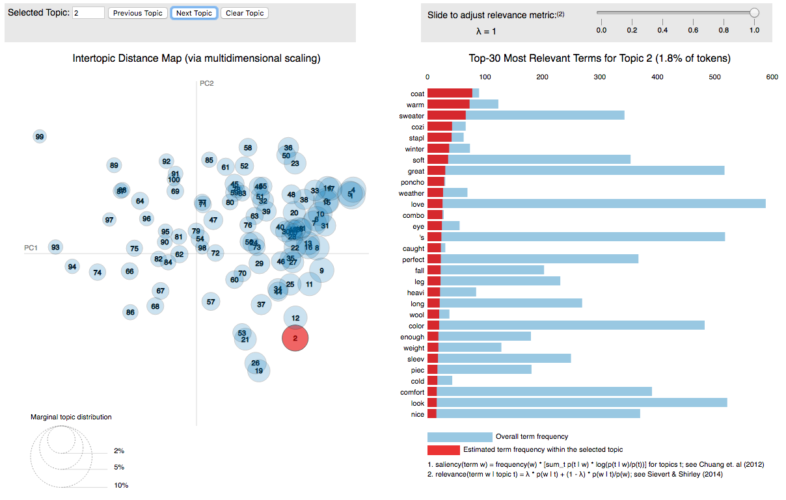
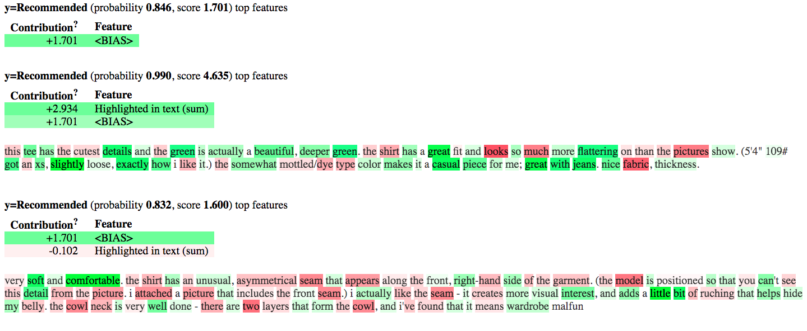

# E-Commerce Comment Classification with Logistic Regression and LDA model

## Introduction

In this project, we will employ an [Laten Dirichlet Allocation (LDA) model](https://en.wikipedia.org/wiki/Latent_Dirichlet_allocation) to analyze customer reviews collected from a shopping website. The dataset in total includes 23,486 records of reviews. For each review, we get information like clothing id, reviewer's age, review title, review text and so on. To conduct text analysis, we first do the pre-processing and vectorization on the text to transform text information into numerical features. The next step is to calculate the [Term Frequency-Inverse Document Frequency (TF-IDF)](https://en.wikipedia.org/wiki/Tf%E2%80%93idf) for each review. Then we train an LDA model and an [Latent Semantic Analysis](https://en.wikipedia.org/wiki/Latent_semantic_analysis)  (LSA, A.K.A. Latent Semantic Indexing) model to extract latent topics, calculate text correlation and output most relevant results. Finally, we use cross-validation to select the optimal number of topics for the topic models. Then we predict the sentiment (Recommended vs Not Recommended) of reviews using the *Bag-of-topic* features (genrated from [Bag-of-words model](https://en.wikipedia.org/wiki/Bag-of-words_model), such as Unigram, Bigram and Trigram) using Logistic Regression.

## Data set

[Women's Clothing E-Commerce data set](https://www.kaggle.com/nicapotato/womens-ecommerce-clothing-reviews) revolving around the reviews written by customers. This data set includes 23,486 rows and 10 feature variables. Each row corresponds
to a customer review, and includes the variables:

* Clothing ID: Integer Categorical variable that refers to the specific piece being reviewed.
* Age: Positive Integer variable of the reviewers age.
* Title: String variable for the title of the review.
* Review Text: String variable for the review body.
* Rating: Positive Ordinal Integer variable for the product score granted by the customer from 1 Worst, to 5 Best.
* Recommended IND: Binary variable stating where the customer recommends the product where 1 is recommended, 0 is not recommended.
* Positive Feedback Count: Positive Integer documenting the number of other customers who found this review positive.
* Division Name: Categorical name of the product high level division.
* Department Name: Categorical name of the product department name.
* Class Name: Categorical name of the product class name.

## Preprocessing

The sample review before process is 

**Absolutely wonderful - silky and sexy and comfortable**. 

And after preprocessing, the vector of textual features is 

**['absolut', 'wonder', 'silki', 'sexi', 'comfort']**.

## LSA

We use `gensim.models.LsiModel` to build the LSA model with 100 topics. In order to demonstrate the topics of the LSA model, we map query word "Good dress", an intuitively positive review, to the 100 dimensional topic space with LSI model. The result is shown in Table 2 of `Report.pdf`.

## LDA

We use `gensim.models.LdaModel` to build the LDA model with 100 topics. We use [Perplexity](https://en.wikipedia.org/wiki/Perplexity) and [Coherence Score](https://radimrehurek.com/gensim/models/coherencemodel.html)[^1] to evaluate this model. A low perplexity indicates the probability distribution is good at predicting the sample. High topic coherence scores indicates a good topic model generating coherent topics that can be described by a short label. The perplexity of our LDA model is -16.616 and the coherence score is 0.371. 

In order to demonstrate the topic model, we use [`pyLDAvis` package](https://github.com/bmabey/pyLDAvis)[^2] for interactive topic model visualization and get the *html* file `lda_ntopic=100.html` as shown in Figure 1. The left side display the inter-topic distance map and the right side display the top-30 most relevant terms for the topic.

Figure 1

Here are several visual elements of `pyLDAvis` (More information can be found [here](https://cran.r-project.org/web/packages/LDAvis/vignettes/details.pdf)): 

1. Default Topic Circles: K circles, one to represent each topic, whose areas are set
to be proportional to the proportions of the topics across the N total tokens in the
corpus. The default topic circles are displayed when no term is highlighted.
2. Red Bars: K ×W red horizontal bars, each of which represents the estimated number
of times a given term was generated by a given topic. When a topic is selected, we
show the red bars for the R most relevant terms for the selected topic, where R = 30
by default (see Sievert and Shirley (2014) for the definition of relevance).
3. Blue Bars: W blue horizontal bars, one to represent the overall frequency of each
term in the corpus. When no topic is selected, we display the blue bars for the R most
salient terms in the corpus, and when a topic is selected, we display the blue bars for
the R most relevant terms. See Chuang et al. (2012) for the definition of the saliency
of a term in a topic model.
4. Topic-Term Circles: K × W circles whose areas are set to be proportional to the
frequencies with which a given term is estimated to have been generated by the topics.
When a given term, w, is highlighted, the K default circles transition (i.e. their areas
change) to the K topic-term circles for term w.

## Sentiment Prediction

We use [`ELI5` package](https://github.com/TeamHG-Memex/eli5) to get the ordered list of relevant textual features to positive sentiment (Recommended) as shown in *html* file `sentiment_topfeature.html` and `eli5_predict.html` (see Figure 2). The green color represents the term relevant to positive sentiment and the red color represents the term relevant to negative sentiment.

Figure 2

## Conclusion

We find that the best model for sentiment prediction is logistic regression using bag-of-topics features generated by LDA model with number of topics of 90 using unigram corpus with cross-validation error of 17.66%.

## Acknowledgment

Thanks to the data support from Nick Brooks and Kaggle. Similar repository includes: 

* [AFAgarap/ecommerce-reviews-analysis](https://github.com/AFAgarap/ecommerce-reviews-analysis): Statistical Analysis on E-Commerce Reviews, with Sentiment Classification using Bidirectional Recurrent Neural Network (RNN)

* [^1]: [Evaluation of Topic Modeling: Topic Coherence](https://datascienceplus.com/evaluation-of-topic-modeling-topic-coherence/)
* [^2]: [Demo page for LDAvis: A method for visualizing and interpreting topics](http://www.kennyshirley.com/LDAvis/)

---

**NOTE: Details can be found in the report `Report.pdf`.**